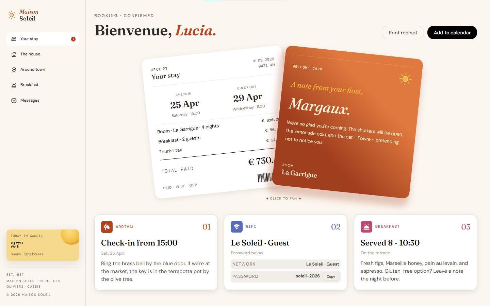

# Frontend Mentor - Hotel booking confirmation page solution

This is my solution to the [Hotel booking confirmation page challenge on Frontend Mentor](https://www.frontendmentor.io/challenges/hotel-booking-confirmation-page). Frontend Mentor challenges help improve coding skills by building realistic projects.

## Table of contents

- [Overview](#overview)
  - [The challenge](#the-challenge)
  - [Screenshot](#screenshot)
  - [Links](#links)
- [My process](#my-process)
  - [Built with](#built-with)
  - [What I learned](#what-i-learned)
  - [Continued development](#continued-development)
  - [Useful resources](#useful-resources)
- [Author](#author)

## Overview

### The challenge

Users should be able to:

- View the optimal layout for the interface depending on their device's screen size
- See hover and focus states for all interactive elements on the page
- Open and close the navigation menu on smaller screens
- Copy the Wi-Fi password to their clipboard using the copy button
- Print a clean receipt using the browser's print dialog
- Download an `.ics` calendar file for the stay dates

### Screenshot

<!-- SCREENSHOT: will be added once assets are provided -->



## Links

- Solution URL: [Solution URL](https://www.frontendmentor.io/challenges/hotel-booking-confirmation-page?tab=submit)
- Live Site URL: [My live site URL](https://shena9y.github.io/Frontend-Mentor---Hotel-booking-confirmation-page-solution/)
- Repo URL: [GitHub repo URL](https://github.com/shena9y/Frontend-Mentor---Hotel-booking-confirmation-page-solution)

## My process

### Built with

- Semantic HTML5 markup
- CSS custom properties
- Flexbox
- CSS Grid
- Mobile-first workflow
- Vanilla JavaScript (menu toggle, clipboard copy, print, `.ics` calendar export, card-fan interaction)

### What I learned

The trickiest bug in this project wasn't visible in the browser console right away — it only showed up when I actually tapped the mobile menu button.

My toggle handler looked fine at a glance, but one line tried to reassign a `const`:

```js
// Before — throws a TypeError on click
const isOpen = guestNav.classList.toggle("open");
menuToggle.classList.toggle("open", isOpen);
isOpen += sidebarBottom.classList.toggle("open"); // ❌ can't reassign a const
```

That crash meant the weather card and footer at the bottom of the mobile menu never appeared. But digging deeper, I found a second, sneakier problem underneath it: my CSS had `.guest-nav { display: flex; }` hardcoded inside the mobile media query, with **no rule reacting to the `open` class at all**. So even with the JS working, the nav links would have been visible on mobile all the time, whether the menu was "open" or not — and the `.sidebar` element itself was locked to `height: 100vh` even when closed, which would've left a big blank gap above the page content.

Fixing it meant treating the mobile menu as three coordinated pieces instead of one:

```js
const isOpen = guestNav.classList.toggle("open");
menuToggle.classList.toggle("open", isOpen);
sidebarBottom.classList.toggle("open", isOpen);
sidebar.classList.toggle("open", isOpen); // expand sidebar to a full-screen overlay
document.body.classList.toggle("menu-open", isOpen); // lock background scroll
```

```css
.guest-nav {
  display: none;
}
.guest-nav.open {
  display: flex;
}

.sidebar.open {
  position: fixed;
  inset: 0;
  height: 100vh;
  z-index: 1000;
}
```

The big lesson: a toggle isn't "done" just because the JS runs without erroring — every class you add needs a CSS rule actually listening for it, or it's a no-op. I've started reading toggle logic and its matching stylesheet side by side now, instead of testing them separately.

### Continued development

- Explore a CSS-only version of the mobile menu overlay using `:has()`, to see how much of the JS could be dropped
- Refine the card-fan interaction (currently click-triggered) for a smoother feel on touch devices
- Look into replacing the hand-tuned pixel offsets on the receipt/host-note cards across breakpoints with a more scalable approach (e.g. CSS `clamp()`)

### Useful resources

- [MDN - Element.classList](https://developer.mozilla.org/en-US/docs/Web/API/Element/classList) - Clear reference for `toggle()`, including the second boolean argument that lets you force a class on/off instead of just flipping it, which is what made the coordinated multi-element toggle possible.
- [MDN - Using CSS custom properties](https://developer.mozilla.org/en-US/docs/Web/CSS/Using_CSS_custom_properties) - Helped me structure the color/spacing tokens from the style guide into reusable `:root` variables.

## Author

- GitHub - [@shena9y](https://github.com/shena9y)
- Frontend Mentor - [@shena9y](https://www.frontendmentor.io/profile/shena9y)
